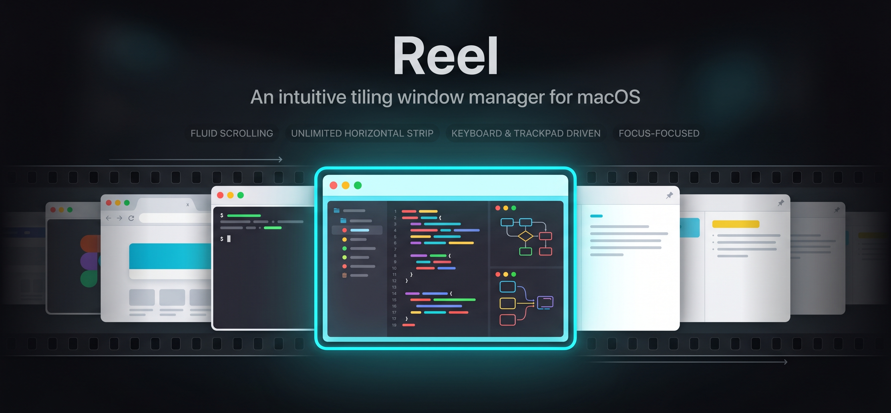

<p align="center"></p>

<p align="center">
  <a href="https://github.com/btj93/reel/releases/latest"></a>
  
  
  <a href="LICENSE"></a>
  <a href="https://github.com/btj93/tap"></a>
</p>

Instead of cramming every window into the visible screen, Reel places them on an **infinite horizontal strip**. The focused window and its neighbors stay visible; everything else is parked off-screen. Scroll left and right to navigate — like a film reel.

Keyboard, trackpad, and mouse are all first-class citizens. Hotkeys for fast navigation, trackpad swipes for fluid scrolling, mouse clicks and drag-to-reorder for direct manipulation — pick whichever feels natural, or mix all three. A CLI tool (`reel-msg`) exposes every action over a Unix socket for scripting and programmatic control.

No SIP disable required. Pure Swift + Accessibility API.

## Demo

<!-- TODO: Record and add demo GIFs. Suggested recordings below. -->

### Strip Scrolling

<!-- Keyboard scrolling through 4-5 windows, showing spring animation and velocity compounding on rapid keypresses. -->

<p align="center"><em>🎬 GIF: Keyboard scrolling through windows with spring physics</em></p>

### Trackpad Gestures

<!-- fn + trackpad horizontal swipe to scroll, showing fluid gesture tracking and snap-to-column on release. -->

<p align="center"><em>🎬 GIF: Trackpad swipe scrolling with snap-to-column</em></p>

### Drag to Reorder

<!-- fn + drag a window title bar to reorder columns, showing the overlay with screenshot thumbnails. -->

<p align="center"><em>🎬 GIF: Drag-to-reorder with overlay preview</em></p>

### Width Cycling & Float Toggle

<!-- Alt-R to cycle column widths (33% → 50% → 67%), then Alt-Space to float/unfloat a window. -->

<p align="center"><em>🎬 GIF: Cycling column widths and toggling float mode</em></p>

### Focus Indicator Styles

<!-- Side-by-side or sequential comparison of ring, raise, and flash focus indicator styles. -->

<p align="center"><em>🎬 GIF: Ring, raise, and flash focus indicators</em></p>

## Features

- **Infinite horizontal strip** — windows tile left to right, one per column. No limit.
- **Spring-based scrolling** — physics-based animation with velocity compounding. Rapid keypresses feel natural.
- **Trackpad, keyboard, and mouse** — swipe to scroll, hotkeys to jump, click or drag to focus and reorder. All three input methods are equally supported.
- **Multi-monitor** — horizontally-aligned monitors share one continuous strip (columns flow across displays, sized to the monitor they're on); stacked or offset monitors get independent strips controlled by cursor position.
- **Space-aware** — switching macOS Spaces saves and restores strip state automatically.
- **Position memory** — windows reopen in their previous strip position across app restarts.
- **Focus indicator** — configurable ring, raise, or flash highlight for the active window.
- **Floating windows** — toggle any window out of the strip, or auto-float by app via rules.
- **IPC** — script Reel via Unix socket CLI (`reel-msg`).

## Requirements

- macOS 14 (Sonoma) or later
- Accessibility permission (prompted on first launch)
- Swift 5.10+

## Permissions

| Permission | Purpose |
|---|---|
| **Accessibility** (System Settings → Privacy & Security → Accessibility) | Required for all core functionality. Reel uses the Accessibility API to discover, move, resize, and observe windows. Global hotkeys and trackpad gesture capture also operate through this permission via `CGEventTap`. |
| **Screen Recording** (optional) (System Settings → Privacy & Security → Screen & System Audio Recording) | Optional. Enables screenshot thumbnails in the drag-to-reorder overlay. Without this permission, the overlay falls back to app icon mode. |

macOS prompts for Accessibility access on first launch. Grant it once — the permission persists across rebuilds when running the debug binary (`.build/debug/Reel`). The `.app` bundle uses a stable code-signing identifier to avoid re-prompting.

No SIP disable required.

## Getting Started

### Homebrew

```bash
brew tap btj93/tap
brew install --cask reel
```

This installs `Reel.app` to `/Applications` and links the `reel-msg` CLI to your PATH.

### Shell Script

> Always [review the script](scripts/install.sh) before piping from the internet to your shell.

```bash
curl -fsSL https://raw.githubusercontent.com/btj93/reel/main/scripts/install.sh | bash
```

This downloads the latest release, installs `Reel.app` to `/Applications`, and links the `reel-msg` CLI to `/usr/local/bin`.

### Manual Download

Download `Reel.app.zip` from the [Releases](../../releases/latest) page.

macOS will prompt for Accessibility permission on first launch — grant it once.

An icon appears in the menu bar. Open some windows — they tile automatically.

### Building from Source

```bash
git clone https://github.com/btj93/reel.git
cd reel
swift build
.build/debug/Reel &
```

When running from source, Accessibility permission persists at `.build/debug/Reel` across rebuilds.

### .app Bundle

```bash
bash scripts/bundle.sh
open .build/bundled/Reel.app
```

The bundle is ad-hoc signed with a stable identifier so macOS won't revoke Accessibility permission on rebuild. Use for distribution; for development, run the binary directly.

## Keybindings

| Action | Default | |
|---|---|---|
| Focus left | `Alt-H` | Scroll to window on the left |
| Focus right | `Alt-L` | Scroll to window on the right |
| Focus up | `Alt-K` | Focus the nearest strip above (multi-monitor) |
| Focus down | `Alt-J` | Focus the nearest strip below (multi-monitor) |
| Move left | `Alt-Shift-H` | Swap focused column left |
| Move right | `Alt-Shift-L` | Swap focused column right |
| Cycle width | `Alt-R` | Cycle 33% → 50% → 67% |
| Full width | `Alt-F` | Toggle full screen width |
| Float/unfloat | `Alt-Space` | Toggle window in/out of strip |
| Close window | `Alt-W` | Close focused window |

> **Note:** `Alt` (Option) key bindings consume special character input (e.g., `Alt-H` produces `˙`). Rebind in config if this conflicts with your workflow. `hyper` (Ctrl+Opt+Cmd+Shift) is supported as a modifier — e.g., `hyper-h`.

**Trackpad:** hold `fn` + swipe horizontally to scroll the strip.

## Configuration

Reel reads `~/.config/reel/config.toml`, created on first launch. Changes apply on save — or use the menu bar "Reload Config" button.

### Layout

```toml
[layout]
gap = 16                              # pixels between columns
snap = ["middle"]                     # "left", "middle", "right" (any combo)
animation_enabled = true
# width_presets = [0.33, 0.5, 0.67]  # proportions for cycle_width
# default_width = { proportion = 0.5 }
# position_memory = true             # restore window positions on reopen

# Insets for external bars (SketchyBar, etc.)
# [layout.struts]
# left = 0
# right = 0
# top = 0
# bottom = 0
```

### Animation

```toml
[animation]
scroll_stiffness = 800       # higher = snappier
scroll_damping_ratio = 1.0   # 1.0 = critically damped, <1.0 = bouncy
bounce_distance = 40         # rubber-band overshoot at strip edges
bounce_damping_ratio = 0.6
```

### Keybindings

```toml
[keybindings]
focus_left = "alt-h"
focus_right = "alt-l"
focus_up = "alt-k"         # multi-monitor: focus strip above
focus_down = "alt-j"       # multi-monitor: focus strip below
move_left = "alt-shift-h"
move_right = "alt-shift-l"
cycle_width = "alt-r"
toggle_full_width = "alt-f"
toggle_floating = "alt-space"
close_window = "alt-w"
```

Modifiers: `ctrl`, `shift`, `cmd`, `alt`/`opt`, `fn`, `hyper` (ctrl+shift+cmd+alt).

### Gestures

```toml
[gesture]
modifier = "fn"   # hold this key + trackpad swipe to scroll
snap = true       # snap to columns on release (false = free scroll)
```

### Cursor

Applies to mouse and trackpad input on windows. Hold the gesture modifier (default `fn`) and click a title bar to bring up the pill action menu; hold + drag to enter drag-to-reorder. Top-bar corners are left untouched so macOS's native corner-resize keeps working.

```toml
[cursor]
long_press_delay_ms = 300         # hold time before the action menu appears
drag_threshold_px = 5             # cursor movement to disambiguate drag vs long-press
swipe_threshold_px = 50           # min 3-finger trackpad swipe distance to switch focus
title_bar_corner_inset_px = 8     # px at each top-corner passed through for macOS corner-resize
```

Set `title_bar_corner_inset_px = 0` to reclaim the corners for Reel's title-bar gestures (you'll lose native top-corner resize on managed windows).

### Focus Indicator

```toml
[focus_indicator]
style = "ring"        # "none", "ring", "raise", "flash"
color = "auto"        # "auto" (system accent) or "#RRGGBB"
width = 3             # border width (ring mode)
corner_radius = 10    # corner radius (ring mode)
```

### Multi-Monitor

Reel groups displays into strips automatically:

- **Horizontally-aligned displays merge into one shared strip.** Columns flow
  across the seam; widths (including `.proportion` presets and full-width)
  resolve against the display the column currently centers on, so a full-
  width column on the external fills the external — not the combined span.
  Heights blend by area as a column straddles two displays of different
  heights.
- **Stacked or offset displays stay independent.** Each display gets its own
  `StripController`. Keyboard commands route to the strip under the cursor
  automatically; `focus_up` / `focus_down` jump focus across strips.
- **Hot-plug / rearrange** — adding, removing, or rearranging displays is
  handled live. Groups merge, split, or dissolve without restart; columns
  migrate by position.

**Alignment rule (for auto-merging):** two displays merge iff they are
X-adjacent (edges touch within 0.5 px) **and** have any non-zero Y-overlap.
Vertically-stacked or edge-touching (zero-overlap) displays don't merge.

#### Required macOS setting

> **"Displays have separate Spaces" must be OFF** for shared-strip mode to
> engage. Open System Settings → Desktop & Dock → Mission Control and toggle
> "Displays have separate Spaces" off.

Why: with separate Spaces enabled, each display has an independent Space
stack, so the two halves of a merged strip could be on different Spaces with
different window sets — Reel's snapshot store would silently discard layout
memory on every Space switch. When Reel detects the setting is ON, it falls
back to per-display strips (no merging) and shows a clickable warning in the
menu-bar item that deep-links to the Mission Control pane.

#### Mission Control drag

Dragging a window to another monitor via Mission Control (or any method that
moves its frame across displays) is detected: the window is removed from the
source strip and adopted into the destination strip, with any saved position
restored.

#### Known limitations

- Very tall external + short built-in: a column on the taller display
  renders at the taller height but gets clipped to the shorter display's
  working area when it straddles the seam.
- Apps that refuse AX resize requests (e.g., System Settings with its
  minimum-width constraint) may appear off-center on strips narrower than
  their minimum width.
- The reorder overlay captures a single display's screenshot — for a drag
  across merged displays, the overlay renders on the display containing the
  dragged column's current frame and may clip at the seam.

### Window Rules

Auto-float windows by bundle ID or title pattern:

```toml
[[rules]]
app_id = "us.zoom.xos"
floating = true

[[rules]]
app_id_regex = "com\\.apple\\.systempreferences"
floating = true

[[rules]]
title_regex = "^Preferences$"
floating = true
```

## CLI

`reel-msg` sends commands to the running Reel instance over a Unix socket. It's bundled inside `Reel.app` — to use it from your terminal, add it to your PATH:

```bash
ln -s /Applications/Reel.app/Contents/MacOS/reel-msg /usr/local/bin/reel-msg
```

```bash
reel-msg list-windows        # JSON list of managed windows
reel-msg focus-left          # scroll left
reel-msg toggle-floating     # float/unfloat focused window
reel-msg get-layout          # JSON layout state
reel-msg recover             # move all windows back on-screen
reel-msg quit                # graceful shutdown
```

All commands: `focus-left`, `focus-right`, `focus-up`, `focus-down`, `move-column-left`, `move-column-right`, `cycle-width-preset`, `toggle-full-width`, `toggle-floating`, `close-window`, `list-windows`, `get-layout`, `list-positions`, `clear-positions`, `recover`, `quit`.

`get-layout` returns a JSON payload covering **every** strip (one per display
group), each strip's current columns with window metadata, stashed per-Space
states the strip has seen this session, and persisted snapshot-store entries
across all groups — useful for scripting and debugging multi-monitor
behavior.

## Architecture

Five Swift modules with strict dependency layering:

```
Reel (app) ──→ WindowManager ──→ Platform ──→ Core
                    │                          ↑
                    ├──→ Config (TOMLKit) ──────┘
                    └──→ IPC ──────────────────┘
```

| Module | Role |
|---|---|
| **Core** | Pure layout logic. `Strip` model, spring animation solver, `computeTargetFrames`. Foundation + CoreGraphics only — fully unit-testable, no AppKit. |
| **Platform** | macOS API wrappers: Accessibility (per-app background threads), CGEventTap hotkeys, CADisplayLink frame loop, display management, focus indicator, gesture capture. |
| **WindowManager** | Orchestration. One `StripController` per display. Window tracking, space switching, position memory. |
| **Config** | TOML config via TOMLKit. Reload via menu bar button. |
| **IPC** | Unix socket server + CLI client. |

## Logs

When running as an `.app` bundle, Reel writes debug output to `~/Library/Logs/Reel/reel.log`. The log is rotated on launch when it exceeds 1 MB (one backup kept as `reel.log.1`). When running the bare binary (`.build/debug/Reel`), output goes to the terminal as usual.

## Building

```bash
swift build                    # debug build
swift run RunTests             # run test suite (no Xcode needed)
make run-debug                 # kill existing, bundle, run with stderr
make run                       # kill existing, bundle, open .app
```

## Troubleshooting

| Problem | Fix |
|---|---|
| Windows not tiling | Grant Accessibility permission in System Settings > Privacy & Security > Accessibility, then relaunch Reel. |
| Hotkeys not working | Another app may have claimed the same key combo. Check for conflicts or rebind in `~/.config/reel/config.toml`. |
| Permission re-prompted on every launch | You're running the `.app` bundle during development. Use `.build/debug/Reel` instead — AX permission persists across rebuilds. |
| Windows stuck off-screen | Run `reel-msg recover` to move all managed windows back on-screen. |
| Aligned displays aren't merging into one strip | macOS "Displays have separate Spaces" is ON — turn it off in System Settings → Desktop & Dock → Mission Control. The menu-bar item also shows a clickable warning that deep-links there. |
| Hotkey goes to the wrong monitor | Hotkey commands route to the strip **under the cursor**. Move the cursor over the display you mean to affect, then press the shortcut. Or use `focus-up` / `focus-down` to switch the active strip. |
| Special characters when pressing hotkeys | `Alt` key combos produce characters like `˙` (Alt-H). Rebind to `hyper-` (Ctrl+Opt+Cmd+Shift) in config to avoid this. |

## Uninstall

### Homebrew

```bash
brew uninstall --cask reel
```

### Manual

```bash
rm -rf /Applications/Reel.app
rm -f /usr/local/bin/reel-msg
rm -rf ~/.config/reel                # optional: remove config
```

## Alternatives

Reel takes a different approach from other macOS tiling window managers:

| | Reel | [yabai](https://github.com/koekeishiya/yabai) | [AeroSpace](https://github.com/nikitabobko/AeroSpace) | [Amethyst](https://github.com/ianyh/Amethyst) |
|---|---|---|---|---|
| Layout model | Infinite horizontal strip | BSP / stacking / float | i3-like tree | Fixed layouts (tall, wide, etc.) |
| SIP disable | No | Yes (for some features) | No | No |
| Scrolling | Spring physics, trackpad + keyboard | N/A | N/A | N/A |
| Config | TOML | Shell + skhd | TOML | GUI + TOML |

## Contributing

Contributions are welcome. Before submitting a PR:

```bash
swift run RunTests   # ensure tests pass
```

The test suite is a standalone executable (`Tests/CoreTests/main.swift`), not XCTest — no Xcode required.

## License

[Apache License 2.0](LICENSE)
